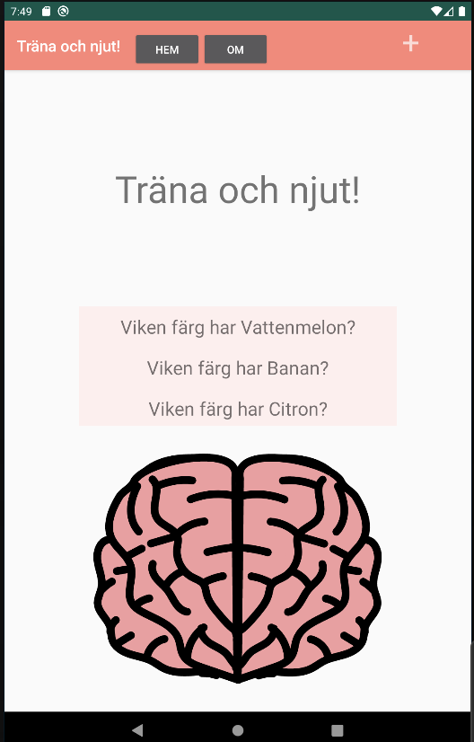
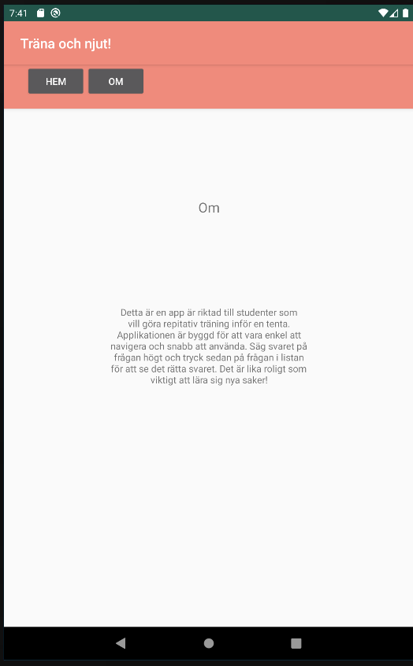

# Rapport

Om Appen
Jag valde att göra en applikation där studenter lätt och snabbt kan träna inför tentamen.
Applikationen fungerar ungefär som ett så kallat flashcard med en fråga som visas i en lista
på skärmen och studenten ska sedan svara på frågan och kan där efter trycka på frågan för
att få fram det rätta svaret och säkerställa att det man svarat stämmer.

Disclamer
Under arbetet med projektet har tekniska problem vart närvarande där emulatorn
tidvis inte fungerat och gradle versionen ställt till problem samt att emulatorns internet
uppkoppling tidvis inte fungerat. Det har gjort att jag gjort om mitt projekt ett flertal
gånger, att mina commits ligger nära varandra i tid och att jag valt att göra vissa kompromisser
när det kommer till appens funtionalitet. Mer om det under implementation.

Implementation

